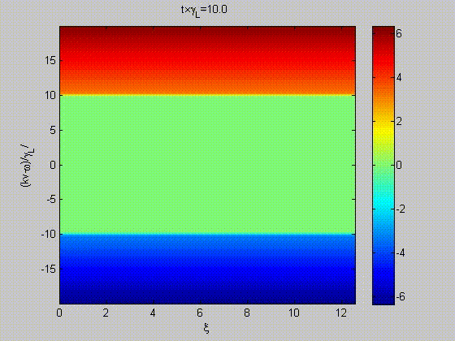

+++
author = "Matt Lilley"
title = "BOT"
date = "2014-06-22"
subtitle="Bump-on-Tail simulation tool"
description="BOT is a Matlab tool for studying the electrostatic instability in the bump-on-tail problem in plasma physics. I originally created this tool in 2011 as part of my post doctoral work at Chalmers University of Technology in Sweden and open sourced it on Google Code"
tags = [
    "science",
    "technology"
]
+++

BOT is a Matlab tool for studying the electrostatic instability in the bump-on-tail problem in plasma physics. The tool has a graphical user interface that enables the user to see how the instability evolves in real time, for example:

I originally created this tool in 2011 as part of my postdoctoral work at Chalmers University of Technology in Sweden and open sourced it on [Google Code](https://code.google.com/archive/p/bump-on-tail/). Today, Github is a better home for open source projects and so the [BOT Github repo](https://github.com/mklilley/BOT) is where the code will live from now on.
