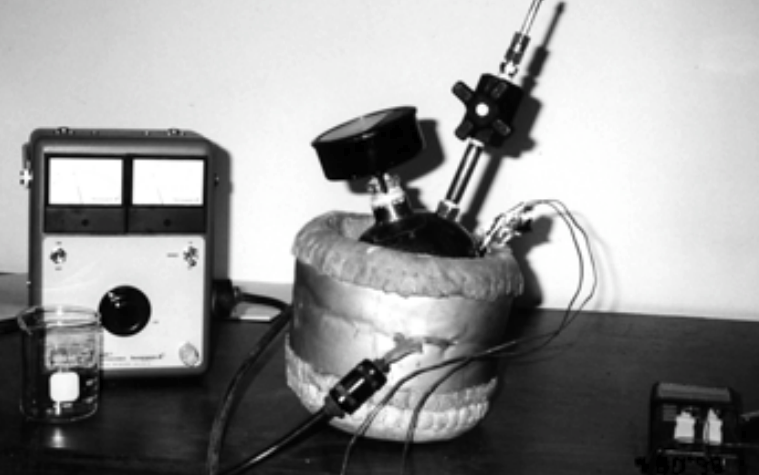

+++
author = "Matt Lilley"
title = "Becoming an experimentalist"
date = "2017-11-27"
tags = [
    "science"
]
subtitle="My foray into cold fusion experiments"
series = ["Cold fusion (LENR)"]
toc = true
+++

[A month ago](/posts/cold-fusion-rabbit-hole), I committed myself to making some local cold fusion connections by placing somewhat cryptic posters in London university physics departments. I was delighted to receive some emails and had some great follow up conversations with curious, open-minded physicists.

One of the physicists was also an entrepreneurial character. He politely critiqued my proposition of neededing £10M to make cold fusion a reality. To paraphrase, "No one is going to give you £10M. What can you demonstrate for £1000?" 😱 .

Now, I'm not an experimentalist by trade (my [academic fusion research](/posts/magnetic-confinement-fusion-instabilities/) was largely theoretical) but £1000 seemed ludicrously small to me. I took his advice seriously though - he is an experimentalist after all (built his own Fusor like the one I was interested in [back in 2014](/posts/fusor-star-mode/)). 

After digging around in the literature I came across work of Les Case [^1],[^2],[^3]. He made cold fusion happen in a pressurised container of deuterium gas at 3.4 atmospheres at 200C with palladium on coconut shell carbon. The [set-up](http://www.lenr-canr.org/acrobat/MalloveEreproducib.pdf) seemed "simple":

surely even a theorist like me could pull this off!

So, this is the task I've charged myself with - to replicate the work of Les Case. It's going to be an exciting journey which I hope you will be part of by following my [experimental log](https://gitlab.com/mklilley/lenr/-/issues/1).

 

[^1]: [G. Mallove, Infinite Energy Magazine Volume 4, Issue #23 (1999)](https://www.infinite-energy.com/iemagazine/issue23/deviceupdate.html)
[^2]: [P. Hagelstein et.al, Appendix B Results of Case Experiments at SRI (2004).](https://lenr-canr.org/acrobat/Hagelsteinnewphysica.pdf#page=18) (This was [Submitted to DoE ](https://lenr-canr.org/wordpress/?page_id=455#MaterialSubmitted)as part of their second review on LENR)
[^3]: [E. Storms, Cold Fusion Now podcast, at 57 min](http://www.coldfusionnow.com/podcast/Ruby-Carat-Edmund-Storms-Cold-Fusion-Now-019.mp3)