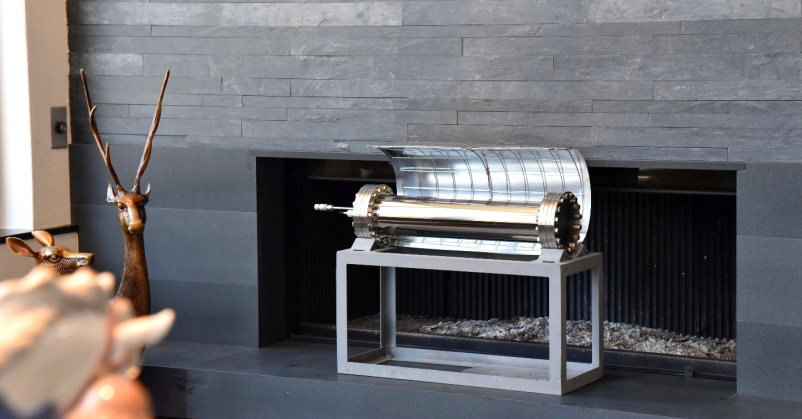

+++
author = "Matt Lilley"
title = "Coconut conundrum"
date = "2019-07-24"
tags = [
    "science"
]
subtitle="Pivoting my cold fusion experiments"
series = ["Cold fusion (LENR)"]
toc = true
+++

If you've been following me [@CasualPhysics](https://twitter.com/CasualPhysics) on Twitter, then you'll have seen the rather large spanner in the works for my [Les Case replication experiments]().



In Dec 2017, I started looking for the catalyst used by Les Case. It was Palladium on activated carbon made by United Catalysts. A fortunate mistaken identity - United catalyst INC vs United catalyst LLC - allowed me to track down the home of the catalyst to [Clariant](https://www.clariant.com/). After a few months in March 2018 I managed to get in touch with the people at Clariant who politely declined to make a new batch for little old me... fair enough. I figured I'd find another way to get some catalyst and I still had lots of reactor building to do. 

Enter Ed Storms - another cold fusion veteran. I've had the amazing opportunity to chat to him this year. He's been a fantastic mentor to me as I've been continuing to build my cold fusion reactor and plan my experiments. In one of our conversations the full story of Les Case's catalyst was laid bear.

Les Case had friends who worked at United catalysts. They gave him a good deal to try lots of different catalysts and only pay for the ones that worked. The one that worked was palladium on coconut shell carbon  🥥. The coconut charcoal contained many elements and was from a specific pacific island. Once United Catalysts ran out, Les Case couldn't get it to work again. All this was also discussed in [Ed Storms interview on ColdFusionNow on 2019/01/13](http://www.coldfusionnow.com/podcast/Ruby-Carat-Edmund-Storms-Cold-Fusion-Now-019.mp3)( timestamp 01:02:40)... I only found out about this now 😢.

So, what does this all mean:
1. Firstly, perhaps it's not the palladium that's special but the substrate it's on - in this case the coconut. Storms has his own ideas that nano sized cracks are an essential part of the mechanism of cold fusion.
2. I need to find another material to use for my experiments otherwse I'm dead in the wateer

I'm not in any position to figure out if 1 is true. On 2, luckily there has been a recent flurry of activity on the [LENR forum around some recent experiments from Mizuo](https://www.lenr-forum.com/forum/thread/6017-mizuno-replication-and-materials-only/?pageNo=1). Much like the Les Case experiment, Mizuno is working with a gas loaded system. Mizuno also claims large amounts of excess heat from his reactor.

It's a solid starting point for me. 

The only difference is that Mizuno works at low gas pressure whereas my reactor is designed for high pressure. It's not at all clear whether Mizunos material will work in my reactor but I'm going to give it a go - right now it's the only thing I can do.

So what are the materials, He rubs Palladium onto a nickel mesh and the mesh is avaiable to buy. Seems like a reasonable pivot.

Let's do this.

As always, you can follow all the nitty gritty details on my [experimental log](https://gitlab.com/mklilley/lenr/-/issues/1).