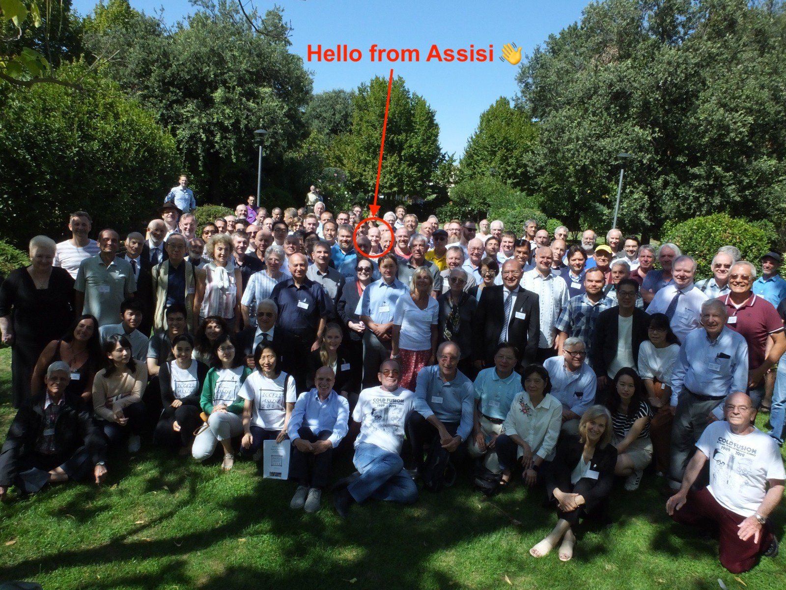

+++
author = "Matt Lilley"
title = "The road to deuterium"
date = "2019-11-29"
tags = [
    "science"
]
subtitle="Next steps in my cold fusion experiments"
series = ["Cold fusion (LENR)"]
toc = true
+++

It's been 3 months since I did my [first cold fusion experiment](/posts/cold-fusion-first-experiment). If you've been following @CasualPhysics on [YouTube](https://www.youtube.com/playlist?list=PLjvHqB5pIFEzQ7qfOdoxW60B0F7OThnW-) and [Twitter](https://twitter.com/CasualPhysics) then you'll know I've been busy. 

I open-sourced all my cold fusion work on the [lilley-lenr Gitlab repository](https://gitlab.com/mklilley/lenr) and moved my [experimental log](https://gitlab.com/mklilley/lenr/-/issues) there too.

I went to my first cold fusion (LENR) conference - [ICCF22](https://iscmns.org/iccf22/) - in September in beautiful Asissi, Italy and I got to meet some of the big names in the field who've influenced me a lot e.g. Peter Hagelstein and Mike McKubre. 

The [research was diverse](https://iscmns.org/iccf22/program/), e.g. Condensed plasmoids ([Jaitner](https://www.youtube.com/watch?v=Gl9paQbjywk&list=PLpEPF2v_du9RBqvUxxOpoO2GSquUjzn2r)), Palladium thin films on Nickel foam ([Mastromatteo](https://www.youtube.com/watch?v=-gZrlxsFT7M&list=PLpEPF2v_du9RBqvUxxOpoO2GSquUjzn2r)), Nano powders with hydrogen ([Iwamura](https://www.youtube.com/watch?v=PwWLcmNieVY&list=PLpEPF2v_du9RBqvUxxOpoO2GSquUjzn2r)), Nuclear excitation transfer ([Metzler](https://www.youtube.com/watch?v=dDIZF9T9Umo&list=PLpEPF2v_du9RBqvUxxOpoO2GSquUjzn2r)) to name but a few! Incredibly inspirational to see all this work and to make some new connections.

In October, I finally sat down to analyse the data from my first experiment and answer the question did I made cold fusion happen?:



Long story short - no I did not make cold fusion happen and you can check out the full analysis of that on the [lilley-lenr repo](https://gitlab.com/mklilley/lenr/-/blob/work-in-progress/code/20190823-NiMesh-PdBurnish-H/temperature-modelling.ipynb). 

The negative result is not unexpected. Most people who've had success in cold fusion have used deuterium instead of hydrogen. Deuterium is an isotope of hydrogen that accounts for approximately 0.0156% of all the naturally occurring hydrogen in sea water. Although the oceans are vast and there is a LOT of deuterium in the world, it's still rare enough to make it expensive and that's why I didn't use it so far.

The time has now come to up my cold fusion game and "power up" my reactor with deuterium (technically I'll be using heavy water - D2O - to make the deuterium on demand). 

I've been blown away by the support I've received on my [GoFundMe campaign](https://www.gofundme.com/f/heavy-water-needed-for-cold-fusion-research) to raise money to buy the heavy water I need for my next experiments.



Once the new deuterium generator is commissioned, then we'll be all set to be (hopefully) dazzled by deuterieum 🤞.

