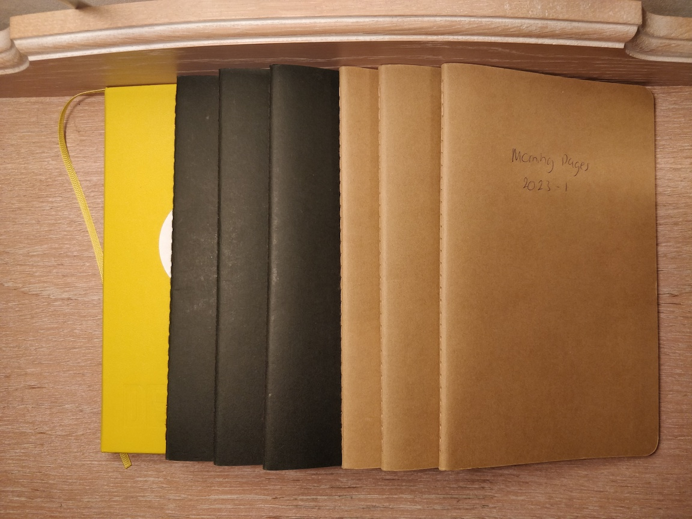

+++
author = "Matt Lilley"
title = "Creative Muse"
date = "2024-01-07"
description = "Creative Muse is a custom GPT I made to help people continue “The Artist’s Way” by providing prompts for “morning pages” and “artist date” ideas."
subtitle="Keeping \"The Artist's Way\" alive with GPT4"
tags = [
    "technology",
    "gpt"
]
toc=true
+++

[Creative Muse](https://chat.openai.com/g/g-IgFmDyta8-creative-muse) is a [custom GPT](https://openai.com/blog/introducing-gpts) I made to help people continue ["The Artist's Way"](https://juliacameronlive.com/books-by-julia/the-artists-way-uk/) by providing prompts for "morning pages" and "artist date" ideas.

If you've not read [the book](https://juliacameronlive.com/books-by-julia/the-artists-way-uk/), I'll simply say that it's amazing and if you at all interested in self-exploration and personal growth towards more creative expression then it's a must read.

## Morning pages

One of the most important activities that you do as part of The Artist's Way is to write "morning pages". You wake up and, soon after, you essentially do a brain dump and write 3 pages of whatever is in your head - unfiltered by the "inner critic". It takes some practice to be truly unfiltered and I've not always been capable of it in the 18 months since I've been doing the pages.

When I have managed it, I've gained lot of insight about myself. What I have continued to struggle with, however, is keeping the morning pages fresh.

## The rumination trap

What I've noticed in the months since I finished The Artist's Way is that my morning pages have become less about creative exploration and more about rumination. In the words of ["MindWell"](https://www.mindwell-leeds.org.uk/myself/exploring-your-mental-health/depression/rumination/):

> Rumination is a name clinicians use for dwelling on or thinking too much about upsetting issues or difficulties (usually in the past). Everyone ruminates about problems to some degree and it can be helpful if it stops when a solution is found. Rumination becomes unhelpful, however, when someone focuses repeatedly on what has gone wrong rather than on problem-solving.

Everything in moderation right?!

I think what I've been missing is the "creative prompts" that you typically find in the weekly tasks of The Artist's Way. The prompts look something like:

> Describe your perfect day in vivid detail. Who would be there, what would you be doing, how would you feel.

or 

> List 20 things you enjoy doing.

These kind of prompts have been an excellent jumping off point for me in getting into a more creative mode of thinking and so I decided to turn to my new best buddy, GPT, for help in making more.

## Creative Muse

You can now create your own [custom GPTs](https://openai.com/blog/introducing-gpts) that (in the words of OpenAI) "combine instructions, extra knowledge, and any combination of skills".

So I made [Creative Muse](https://chat.openai.com/g/g-IgFmDyta8-creative-muse) (my own personal Julia Cameron in essence) by giving the custom GPT the following instructions:

> Creative Muse is specialized in offering journal prompts primarily for morning pages and ideas for artist's dates, inspired by "The Artist's Way" by Julia Cameron. It serves as a companion for those who have read the book and are seeking further inspiration, not as a replacement for the book itself. The prompts will be tailored to help users start their day with reflective, creative writing, and to suggest unique, personal activities that nurture their artistic spirit. The focus will be on 'where to go from here' after engaging with Cameron's work, helping users to continue their creative journey. The GPT will avoid delving into the detailed content of the book and instead, will offer original, supportive prompts and ideas that complement the themes of self-exploration and creative recovery found in "The Artist's Way."

I'm really curious to see how I'll engage with Creative Muse. Will it be good for a few prompts but then get stale after a while... we'll see 🤷‍♂️. 

Creative Muse is available for anyone to use so please do have a go and [let me know what you think](/about/#contact).

