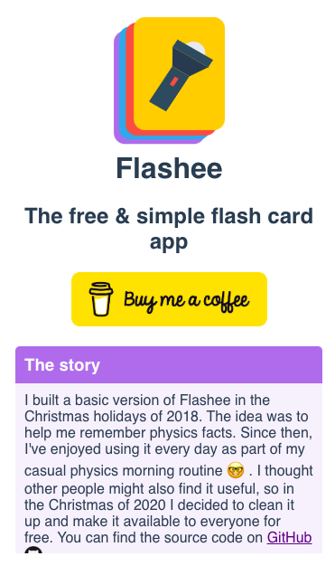

+++
author = "Matt Lilley"
title = "Flashee"
date = "2020-12-30"
description = "There's no such thing as an original idea, and this is especially true of flashcard apps. There are MANY apps out there and yet all of them suck (in my humble opinion 🤣)"
subtitle="The free and simple flash card app"
tags = [
    "technology"
]
+++

There's no such thing as an original idea, and this is especially true of flashcard apps. There are MANY apps out there and yet all of them suck (in my humble opinion 🤣)

I wanted a flashcard app that:
- worked off-line by default
- didn't require me to sign-up for an account
- didn't have any bells and whistles, I wanted it to be dead simple

Maybe this kind of app did exist somewhere in the dark corners of the web 🤷‍♂️, but I didn't really want to go lurking... and I also like building things... and so:

<!--  -->



I built a basic version of [Flashee](https://flashee.lilley.io/) in the Christmas holidays of 2018. The idea was to help me remember physics facts. Since then, I've enjoyed using it every day as part of my casual physics morning routine 🤓 . I thought other people might also find it useful so I decided to clean it up and make it available to everyone for free.

## How I made Flashee

If you're interested in geeking out over how I built Flashee then you can find out more at the [Swipee Github repo](https://github.com/mklilley/flashee).