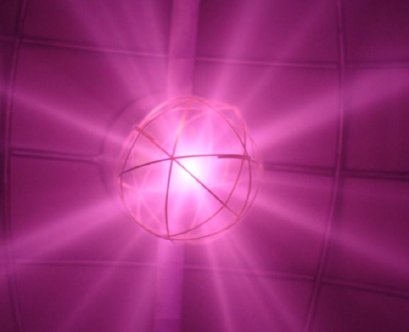

+++
author = "Matt Lilley"
title = "Fusor - Star mode"
date = "2014-08-04"
description = "Understanding if enhanced electrostatic fusion is possible"
tags = [
    "science"
]
+++

One of the original concepts for a fusion reactor involved the use of electric fields from spherical charged wire grids [^1],[^2],[^3] - something now known as a [Fusor](https://en.wikipedia.org/wiki/Fusor).  It was envisioned that the large fields would accelerate charged ions up to the high energies required to overcome their mutual repulsion and allow nuclear fusion to occur – releasing energy in the process.  Initial experiments demonstrated fusion reactions [^4],[^5],[^6], but collisions between the ions and the grid proved to be too frequent to allow its application to energy generation.

[^1]: [P. T. Farnsworth, U.S. Patent No. 3258402 (1966).](https://www.google.com/patents/US3258402)
[^2]: [P. T. Farnsworth,  US Patent No. 3386883 (1968).](https://www.google.com/patents/US3386883)
[^3]: [R. Hirsch, Journal of Applied Physics, 38, 4522, (1967).](https://dx.doi.org/10.1063/1.1709162)
[^4]: [W. Elmore, J. Tuck, and K. Watson, Physics of Fluids, 2, 239, (1959).](https://dx.doi.org/10.1063/1.1705917)
[^5]: O. A. Lavrent’ev, Ukrainian Journal of Physics, 8, 440, (1963).
[^6]: [R. L. Hirsch, Physics of Fluids, 11, 2486, (1968).](https://dx.doi.org/10.1063/1.1691842)

<!--  -->

It was found in 1997, by G. H. Miley [^7], that Fusors can operate in a regime with fewer collisions between the accelerated ions and the grid. This “Star Mode”, as it has come to be known, could in principle give the Fusor a new lease of life, but at present there is no complete understanding of the physics involved.

[^7]: [G. H. Miley, et al., IEEE Transactions on Plasma Science, 25, 733, (1997)](https://fsl.ne.uiuc.edu/IEC/Miley_IEEE%20Trans%281997%29.pdf)

I decided to do some research on this topic in 2013. A calculation of the trajectories of individual particle orbits revealed a "stability boundary" that separates particles that collide with the grid and those which never do. This boundary suggests why Star Mode is only apparent at low gas pressures, but more detailed self-consistent simulations are required to be conclusive. More details can be found in my [poster presentation](Lilley-Star-Mode-2013-APS.pdf) from the 2013 Annual Meeting of the APS Division of Plasma Physics.
