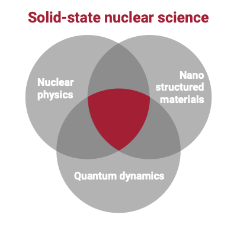

+++
author = "Matt Lilley"
title = "Gentle nuclear"
date = "2020-08-24"
description = ""
tags = [
    "science"
]
subtitle="Engineering the nucleus"
Description="Have you ever thought about a world where nuclear energy doesn't mean radiation and toxic waste? Sounds like a far-fetched idea, right? In the video above, we challenge the usual perceptions of nuclear energy to see if we can harness it in a gentler, safer way. "
series = ["Solid state nuclear science"]
+++

Hey everyone 👋 and welcome to this new series of posts on [Solid state nuclear science]().

For those following the series of posts about [my cold fusion experiments](), you may recall that Florian Metzler and I mused over the idea of doing some theory/modelling work during my [visit to MIT last year](). Since the start of this year, a small group of us have been meeting once a week and attempting to gain a better understanding of the proposed physical mechanisms for cold fusion (LENR). 

Through our discussions, it's becoming clear that understanding the various anomalies surrounding cold fusion requires an interdisciplinary approach that we call `solid-state nuclear science (SSNS)`.

SSNS can be said to lie at the intersection of quantum dynamics, nanostructured materials and nuclear physics and is concerned with the interplay of the molecular, atomic, and sub-atomic scales. It's an emerging field which is difficult to navigate and the barrier to entry is quite high. So, we've created [Project Ida](https://project-ida.org/) which aims to be an accessible hub for this new field.

In doing this work, the biggest shift in my mindset is to appreciate that this approach is less focussed on the specific question "how is cold fusion possible?" and more on the general question "can we engineer nuclear reactions?". To that end, I've made a video that I hope will give you a sense of what might be possible.



Have you ever thought about a world where nuclear energy doesn't mean radiation and toxic waste? Sounds like a far-fetched idea, right? In the video above, we challenge the usual perceptions of nuclear energy to see if we can harness it in a gentler, safer way. 

We venture into the complex world of radiation, breaking it down in an easy-to-understand way using trees and plants as our guides. These natural wonders have mastered quantum physics to manipulate energy at an atomic scale and we can use what they know to potentially unlock a new age of nuclear energy.

We'll look at some groundbreaking experimental results from places like MIT to show how this isn't as far fetched as you might initially think. There's still a lot to learn, and the quantum physics behind it is notoriously tricky, but it's definitely a topic worth exploring.

Enjoy.