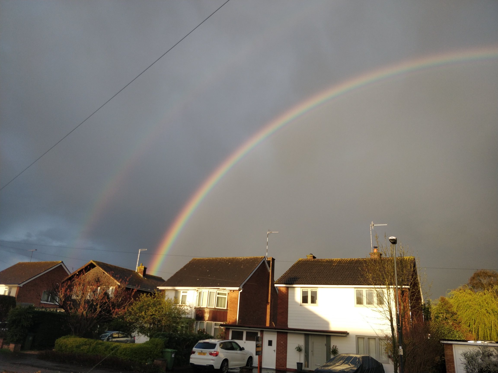

+++
author = "Matt Lilley"
title = "Let's make rainbows 🌈"
date = "2023-06-30"
description = "I saw the most spectacular rainbow not long ago and wondered whether I could simulate it 🤔. I decided that, with the help of GPT, it would be totally doable and super fun."
tags = [
    "education",
    "science",
    "technology",
    "GPT"
]
subtitle="Creating digital rainbows with GPT4"
series = ["Let's make"]
draft = true
toc=true
+++

## Motivation

I saw the most spectacular rainbow earlier this year.



I should have been fully present in that moment (still working on that). However, I suddenly realised that, although have a physics PhD, I never really spent much time studying rainbows. I somehow managed to opt out of undergraduate optics classes which seems madness in hindsight. In my defense, I was doing a Maths & Physics course so something had to give 🤷‍♂️.

After the usual "pot of gold" ⚱️ jokes had been told and the spectacle faded into the clouds, I pondered on whether I could recreate this rainbow... inside my computer. In other words, could I simulate a rainbow?

The physics at play is well known - [refraction](https://en.wikipedia.org/wiki/Refraction), [dispersion](<https://en.wikipedia.org/wiki/Dispersion_(optics)>), [total internal reflection](https://en.wikipedia.org/wiki/Total_internal_reflection) - and we learnt about them all at school; so it should be simple right? I've made enough apps and simulations in my time to know it's never simple...ever!

And so, this lovely rainbow idea was consigned to the "Someday" page of my notes... that is, until I was emboldened by my recent success using GPT4 to help me create a [particle simulation](). After that, I was convinced that the rainbow idea was not only doable, but would be super fun.

## Result

2.5 weeks later, GPT and I finished making the first iteration of the interactive [Let's make rainbows app](https://mattlilley.com/lets-make-rainbows/). It allows you to explore the underlying
physics of rainbow formation by shooting light rays at various shaped prisms
and watching how the different colours bend and reflect. You can even make your
own shapes and also challenge yourself to traverse a "prism maze".

I think the app is fun, but of course it's not really "simulating a rainbow". It turns out the practical details are kind of complicated and so, as a first step, I decided to create something "simple" and not worry too much about the bits of physics that aren't quite right.

Despite the imperfections, my hope is that through experimentation people will develop a intuition for how light behaves and gain a deeper appreciation for the beauty of rainbows 🌈.

## The Process

### Play vs production

Unlike my [constrained particles simulation](), which took me and GPT an afternoon to complete, "Let's make rainbows" took 2.5 weeks to build. Most of that time was not actually spent implementing the core physics. It only took a few days to start producing cool looking rainbow patterns with semi-realistic physics, like this:

<figure>
  <video controls src="tie-prism.mp4" style="width:100%"></video>
  <figcaption class="image-caption">100% reflective boundaries, 15x speed</figcaption>
</figure>

Instead, I spend a lot of time thinking about user expectations, their behaviour, differences between desktop and mobile experiences and testing. My past self was indeed correct "it's never simple...ever".

There is a huge gulf between making something work for you and making something work for other people. The process of taking an idea into "production" (even in a first iteration kind of way) requires you suspend all playfulness. You need (among other things) concrete "user journeys", a robust user interface (UI) and you need to have anticipated the myriad ways in which your users might break all things 😣.

Now, don't get me wrong, there is nothing bad about the productionising process and it's rewarding to see an idea through to completion. However, every time I've made something "for production" I've always ended up feeling a bit flat afterwards. Perhaps this is just my way of working. I tend to treat everything as a sprint instead of a marathon and I have a habit of setting arbitrary deadlines and then beasting myself to meet them. By the end, I'm asking myself "Why am I doing this?" and "for fun" has kind of left the building by that point as I'm reduced to marvelling at my productivity/efficiency/agileness. For a project about 🌈 ... let's just say it's the wrong vibe 😂.

### Libraries

As ever though, I learnt a TONNE! In particular, my knowledge of the canvas drawing library [p5.js](https://p5js.org/) has gone 🚀. One of the biggest learnings was in understanding colour blending. To give you a flavour:

- In the real world, all colours of light mix together to make white light
- In the real world, two overlapping beams of the same colour light just make a brighter version of that colour, e.g. two faint orange beams of light overlap to make brighter orange
- In p5, white light was easy to make, but brighter orange seems impossible

p5's [blendMode](https://p5js.org/reference/#/p5/blendMode) allows you to mix colours. `blendMode(ADD)` literally adds the colour values of one colour to another. But what does that mean? Let's take orange:

```
// RGB colour is 3 numbers, Red, Green and Blue
// Max for any colour is 255
// Orange is a mixture of mostly red and some green apparently
orange = [255, 165, 0]

// blendMode adds the colour numbers but maxes out at 255
blendMode(ADD)
orange + orange = [255, 255, 0]
```

Two orange colours does not make a brighter orange, it makes max red + max green... that's yellow 😫 ! As you can see in the [transcript with GPT](https://chat.openai.com/share/5fc21908-69fa-4a7d-8f43-f0515f59b4ff), I spent a good chunk of time trying to find ways around this because `orange + orange = yellow` did not seem like an acceptable compromise to me! Ultimately, I was unsuccessful, but I was able to minimise the horror by:

- Making sure light rays were not overlapping as they were being drawn. In the beginning, my light rays were actually just lots of circles drawn one after another...that wasn't going to fly.
- Adding some transparency to the colours. I must confess this was mostly trial and error to find the right look.

Colour issues notwithstanding, I found the process of creating things with p5 to be really fun. As the p5 peeps say:

> p5.js is a JavaScript library for creative coding...

and i think it really lives up to that. You don't have to worry about the usual web dev things like creating HTML elements, setting up events listeners etc. Most of the time you are just drawing pixels onto a canvas and p5 steps in to the event listener void with helpers like [mouseIsPressed](https://p5js.org/reference/#/p5/mouseIsPressed) which behaves exactly as you expect... it automatically toggles between `true` and `false` when the mouse is pressed or not 👏. In this sense, p5 allows your ideas to flow more easily from your brain to the page and that creates a very enjoyable experience (at least for me).

Buuuuut (you knew there was a but coming right 😉), I did find it a bit tricky adding a nice UI when I was getting the app ready for "prime time". This is of course not what p5 was made for, but because p5 does actually allow you to make HTML buttons and sliders etc, I carried on coding in the p5 way for longer than I should have. The result, a [code base](https://github.com/mklilley/lets-make-rainbows) that is... well let's be honest... a bit of a mess. It works, but will I be able to add stuff to it in a few months time... not sure.

Reactive UI, data sharing across components etc, this is territory of [React](https://react.dev/) / [Vue](https://vuejs.org/) / [Svelete](https://svelte.dev/) / [Angular](https://angular.io/). These libraries/frameworks require you to add additional dependencies and build tools to your process, but they also force you to adopt their design patterns which generally result in more robust and understandable code in the long run. I've made apps using these kind of tools before, e.g. [Swipee]() and [Flashee](), [Squidler](), so I know all this... I guess I was just wishfully thinking this little app would be different. Silly Matthew with his head the the clouds 🌈.

Ok, enough about me. Let's talk about the biggest enabler of this project.

### GPT

Just like [my last project](()), there is simply no way I would have been able to make this app in this timescale without the help of GPT4. GPTs knowledge, communication style and problem solving abilities are breathtaking. This project was a lot more sophisticated than my last one with a very solid knowledge of physics and geometry needed. My requirements were also shifting in real time as I was figuring out what it was I actually wanted to build. Yet, GPT was mostly able to roll with the punches and read in between the lines when my prompts were not totally clear and were riddled with typos.

It was not all smooth sailing though. I found myself needing to remind GPT about what we were doing quite a few times and at one point GPT jumped into python code even though we'd been doing javascript up to that point. I suspect I was experiencing the limitations of GPT4's "context window". You can of think of a context window in a similar way to a humans "working memory". According to The Atlantic article ["GPT-4 Has the Memory of a Goldfish"](https://www.theatlantic.com/technology/archive/2023/03/gpt-4-has-memory-context-window/673426/), GPT4 has enough working memory for an hours worth of conversation which of course isn't nearly long enough for a long project. The article makes a nice GPT/human comparison :

> The human mind is able to sort experience into categories: We (mostly) remember the important stuff and (mostly) forget the oceans of irrelevant information that wash over us each day. Large language models do not distinguish. They have no capacity for triage, no ability to distinguish garbage from gold. “A transformer keeps everything,” Dimakis told me. “It treats everything as important.” In that sense, the trouble isn’t that large language models can’t remember; it’s that they can’t figure out what to forget.

This suggests that collaborating on a larger project with GPT will work best when the project can be separated into lots of small modular pieces that don't require a large shared context. One could then imagine several GPT conversations:

- Brainstorming → results in a well defined idea
- Planning → results in list of well defined "modules"
- For each module:
  - Building → results in working code

The ChatGPT interface is not really geared up this kind of chat grouping, but I'm sure new interfaces like this will develop over time. Food for thought 🤔.

If you're interested, you can [read the transcript](https://chat.openai.com/share/5fc21908-69fa-4a7d-8f43-f0515f59b4ff) between me and GPT.

## Extensions

At its core, "Let's make rainbows" is just another particle code. The simulation only looks like rays of light because I display the history of where the particle has been. Considering that light can be thought of as photons, it's not a terrible model. In addition, this approach has some computational advantages:

- Moving individual photons in straight lines is "straight forward"
- The user gets to see the dynamics of the light unfold
- Although colour mixing of different "rays" is imperfect, it is handled automatically by the canvas's blendMode

Another approach could be taken. Because we know the light moves in rays in straight lines (it doesn't really but that's is a [rabbit hole](<https://en.wikipedia.org/wiki/Ray_(optics)>) that we won't go down today), we don't actually need to move the photons step by step. We just need to trace forwards to find where the photons hit the prisms and the boundaries and calculate the refraction and reflection angles accordingly. The main advantage of this approach is that users could manipulate the prisms shape/orientation and see how all the light rays alter without having to wait for a simulation to unfold.

Yet another approach could also be taken. Instead of treating the light as particles or rays, we could treat the light as a field (light can also be thought of as wave of the electromagnetic field so this has a physical basis). So far nothing controversial. But, how about 3 fields, the red, green and blue fields. Colour is then defined and evolved on every pixel, not just where our 6 beams of light have been. This way, we'd expect to see a continuous spectrum of refracting colours which is much more physical. It's worth saying, I've actually never seen this way of thinking about light and I'm not 100% sure it makes sense 🤷‍♂️. I do however have a hunch that there are some differential colour equations out there waiting to be written and I'm sure the resulting simulation would look beautiful.
