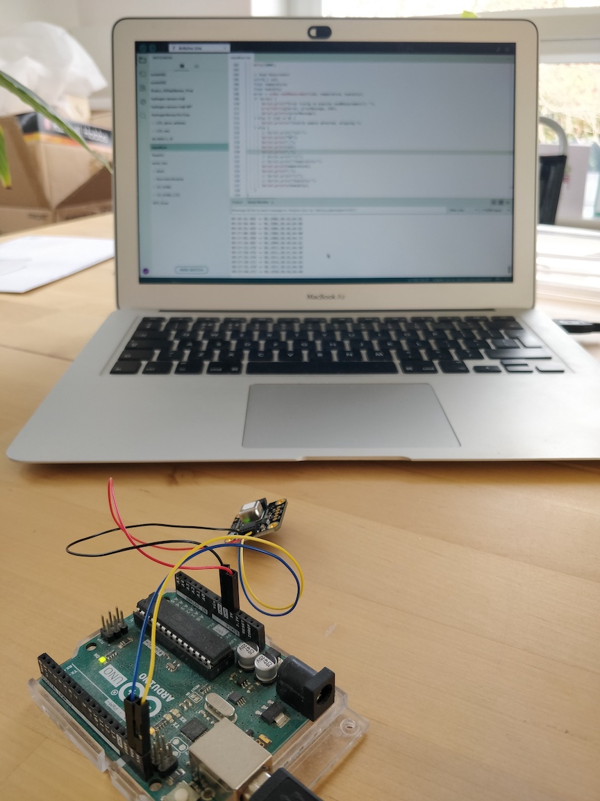
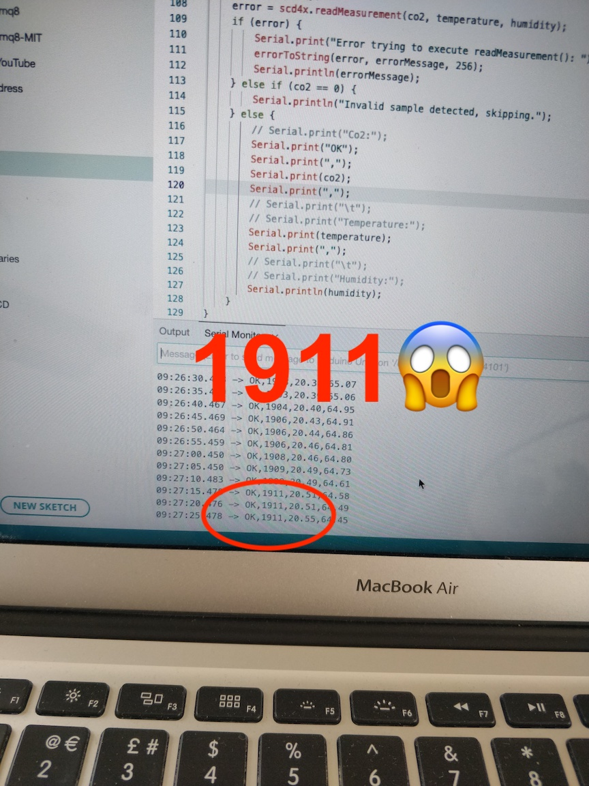
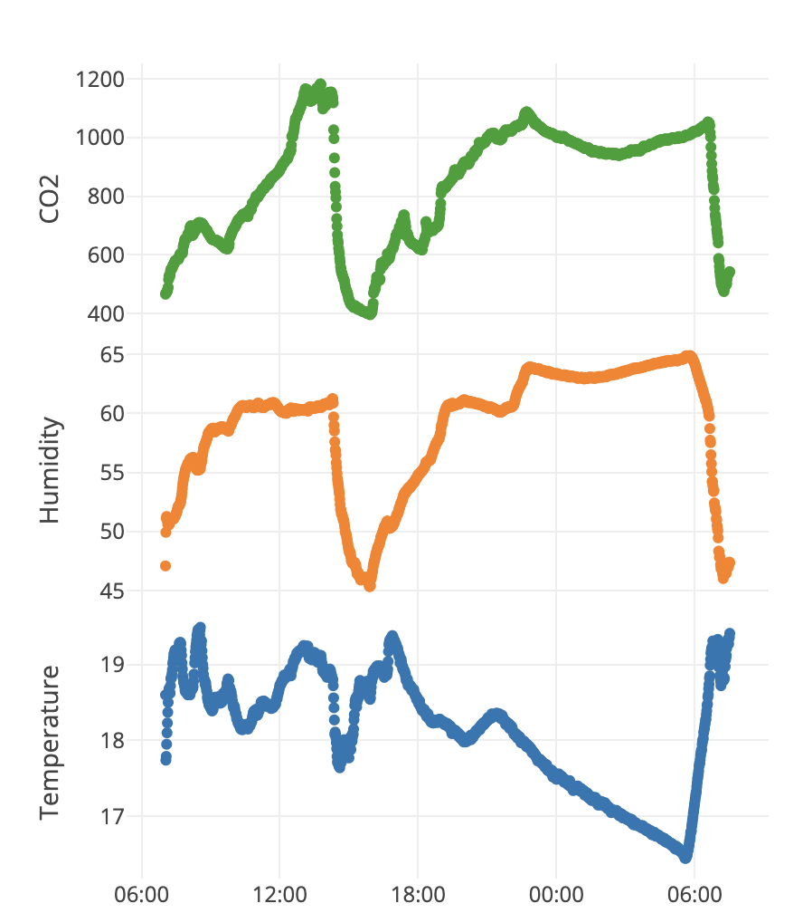
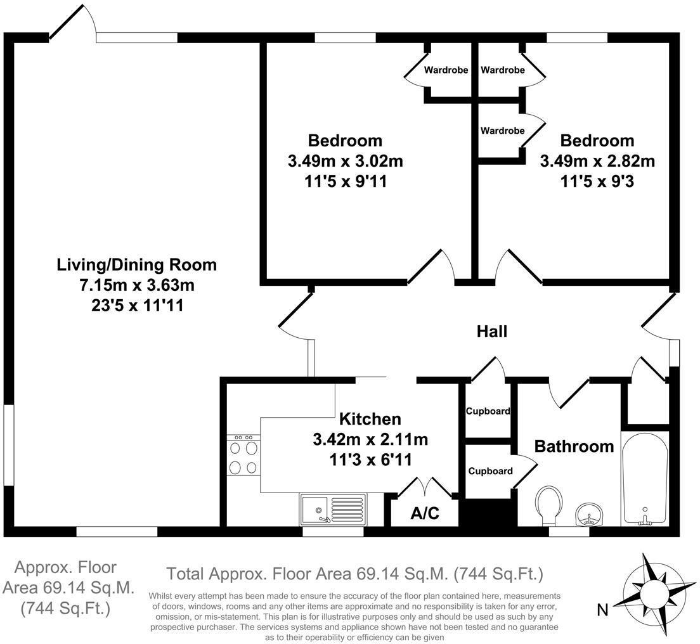

+++
author = "Matt Lilley"
title = "Microclimate change"
date = "2024-04-07"
description = "I love my new flat, but I'm getting headaches. There's not a lot of ventilation and I have a sense that just my breathing might be enough to alter my microclimate."
subtitle="A CO2 detective story in my flat"
tags = [
    "science",
    "technology",
    "education"
]
math=true
toc=true
+++

### Why $CO_2$?

I recently moved into a new flat which I adore. There's light everywhere and my peace Lily is already signalling her sign of approval - a flower 🥰.

The only rub is that I've started to get headaches 😖 and I have a suspicion that my microclimate might be more conducive to my plants than to me. 

You see, there's not a lot of ventilation in my flat unless I open the windows... and let's just say I'd rather not do too much of that in the winter 🥶. Humans are notorious for making plenty of carbon dioxide ($CO_2$) and, although I'm not running a fossil fuel plant in my flat, I have a sense that just my breathing might be enough to raise the $CO_2$ concentration to an uncomfortable level.

For reference, outside $CO_2$ concentration is about 400ppm. The `ppm` stands for `parts per million` and it literally means for every 1 million molecules in the air, 400 of them will be $CO_2$. It's actually not that much when you think about it - 0.04% - but it's enough to keep the planet warm and provide the plants with the carbon they need to grow. Pretty amazing.

It's worth noting here that carbon **monoxide** poisoning should always the first worry in situations like this, so do get yourself a carbon monoxide alarm if you've not already.

OK, so how am I going to test my hypothesis of human caused microclimate change:
1. Measurements
2. Guesstimation

### Measuring $CO_2$

Luckily for me, I happen to have a $CO_2$ sensor (combined with temperature and humidity) in my "box of tricks" from a couple of years ago, so I can check pretty quickly whether it's the $CO_2$ that's causing my headaches 🙌.

The sensor is called `SCD-41` and, as far as sensors go, it looks pretty cute.

You can also readily attach it to an Arduino thanks to the [folks at Adafruit](https://www.adafruit.com/product/5190) 🙏.

Side note, you can find all the code I used for this project on my [Sensors repository on Github](https://github.com/mklilley/sensors/tree/main/SCD-41) if you'd like to have a go at this yourself.

So, what's the result... not good... not good at all.
 

1911ppm is about 5 times higher than the background concentration outside which I was honestly shocked by. Of course I immediately consulted my <strike>Doctor</strike> ChatGPT on the implications of such an increase 😉:

> Below 1,000 ppm: Generally considered acceptable in terms of air quality, with minimal likelihood of causing headaches or other symptoms for most people.
>   
> 1,000 to 2,000 ppm: Levels in this range are often associated with complaints of drowsiness and poor air quality. Some individuals may start to experience headaches and other mild health effects due to reduced ventilation and oxygen intake.
>   
> 2,000 to 5,000 ppm: At these levels, CO2 exposure can lead to headaches, sleepiness, sluggishness, a diminished ability to concentrate, increased heart rate, and slight nausea. The risk of adverse health effects increases with prolonged exposure.
>   
> Above 5,000 ppm: Exposure to CO2 levels above 5,000 ppm can result in serious oxygen deprivation leading to significant health issues such as severe headaches, increased heart rate, shortness of breath, dizziness, sweating, fatigue, poor decision-making, or even loss of consciousness.

Ok, so I'm not going to die, but the $CO_2$ concentration is definitely getting into the headache zone.

Next question, am I actually causing this? The short answer is yes and if you want to see how I figured this out using my guesstimation powers then jump to the [Guesstimating $CO_2$](#guesstimating-co_2) section below.

The final question is of course what I can do about the elevated $CO_2$. Obviously the answer is simply to open the windows... we knew that already. But, how long and how often do I really need to do this? Will 5 mins a day suffice or is it much longer? I collected the data over time and ran some little experiments with opening windows to find out.

This time, I connected the Arduino to a Raspberry Pi using a USB cable and ran some python code to read the output from the Arduino and save it to Google's Cloud Firestore database. The code is in my [Sensors repository on Github](https://github.com/mklilley/sensors/tree/main/SCD-41).

In the example above, I opened the windows at 14:20 and 1 hour later we were back to outside levels. On a warm day this is fine, but in winter 1hr is less than ideal shall we say. I found that I could reduce this time to about 15 mins by opening the balcony door instead. I'm not sure whether I can really avoid the inevitable drop in temperature that way, but at least it's over and done with as quickly as possible. Or... just develop more tolerance to the cold ... you'd never think that I lived in Sweden for a couple of years would you 😂.

Let's switch gears now and see how I can use my knowledge of the world to figure out that I am genuinely to blame for all this $CO_2$ business.

### Guesstimating $CO_2$

I'm going to turn to the tried and tested technique of guesstimation to get a rough sense of whether the $CO_2$ from my breath is even remotely capable of raising the concentration by 5x. Shameless plug btw, I've got a whole video series on [Guesstimation on YouTube](https://www.youtube.com/playlist?list=PLjvHqB5pIFExT9QKjN_G0Ko1eMTv9xXgP) if you like this kind of thing (like and subscribe 😅).

#### Make the plan 

They key to doing any guesstimation is having a "mental wiki of the world" - a store of seemingly random bits of information that you can access on command without an internet connection. It could include:
- $4\times 10 ^8$ m - Earth-Moon distance
- 15 TW - power consumption of the human race
- 100 mA - lethal electrical current for a human
- 1 kg - human daily food consumption
- ... 

The advantage of having this wiki is that it allows you to reason about the world on the fly and helps you sense check information you receive from external sources.

Ok, so let's start reasoning about this problem. I'm going to need to:
1. Calculate the total number of molecules $\left(N_{\text{air}}\right)$ in the air inside my flat
1. Calculate the number of $CO_2$ molecules $\left(N_{CO_2}\right)$ I produce in a single day from breathing
3. Calculate the $CO_2$ concentration in ppm by $N_{CO_2} / N_{\text{air}} \times 10^6$
4. Compare this concentration with the 400ppm outside levels

The difficulty here is of course in steps 1 and 2. The tendency at this stage can be to throw our hands in the air and declare it's just too difficult - there's too much complexity, too many unknowns 😫. The challenge is to remain Zen 🧘‍♂️ and calmly plumb the interior depths of the mind for entries in the mental wiki that might help. Always keep in mind that guesstimation is about getting to a ballpark answer. When we let go of precision, we always find that we know more than we think.

Here's a few entries from my mental wiki that I think might help:
- $2.5$ m - height of the rooms in my flat
- $2.5\times 10^{25}$ molecules per $\text{m}^3$ - number density in the air 
- $1$ kg - food consumed by a human per day
- Our bodies "burn" (technically it's oxidise) sugar to make water and carbon dioxide
- $C_6 H_{12} O_6$ - chemical formula for glucose (sugar)
- $CO_2$ - chemical formula for carbon dioxide
- $H_2O$ - chemical formula for water
- $12, 1, 16$ - the atomic masses of Cabon, Hydrogen and Oxygen respectively
- $1.67 \times 10^{-27}$ kg - the unified atomic mass unit (u)

Let's piece it all together:
- Step 1 - molecules of air
  1. Figure out the floor area of my flat  - call it $A$
  2. Calculate the volume of the flat $V = A\times 2.5$
  3. The number of molecules of air is then $N_{\text{air}} = V\times 2.5\times 10^{25}$
- Step 2 - molecules of $CO_2$
  1. Assume the 1kg of food we eat is (or will eventually be turned into) sugar
  2. Calculate the mass of a single molecule of sugar (call it $m_{\text{sugar}}$) using the chemical formula and the atomic mass unit
  3. Calculate how many sugar molecules we consume per day $N_{\text{sugar}} = 1 \text{kg}/m_{\text{sugar}}$
  4. Figure out how many $CO_2$ molecules get produced for every glucose molecule burnt - call it $N_{\text{burn}}$
  5. The number of $CO_2$ molecules is then $N_{CO_2} = N_{\text{sugar}}\times N_{\text{burn}}$

So now we've got the plan, now all that's left is to... do the plan.



#### Do the plan 

God bless [rightmove](https://www.rightmove.co.uk/) for making property records so conveniently available 🙏. I was able to get the floor plan for the identical flat beneath mine.

You can see my flat has an area of about $70 \ \text{m}^2$ - one to add to my mental wiki 🤓. So for "Step 1 - molecules of air" the volume of my flat is:

$$V = 70 \times 2.5 = 175 \ \text{m}^3$$

and the number of molecules of air is:

$$N_{\text{air}} = 175 \times 2.5\times 10^{25}$$

I've deliberately left that last calculation unfinished for reasons you'll see shortly.

For "Step 2 - molecules of $CO_2$" we can work out the mass of a molecule of glucose by inspecting its chemical formula:

$$C_6 H_{12} O_6$$

It means a single molecule of glucose contains 6 carbon atoms, 12 hydrogen atoms and 6 oxygen atoms. The mass of a sugar molecule it therefore:

\\begin{align}
   m_{\text{sugar}} &= 6\times 12 + 12\times 1 + 6\times 16 = 180 \ \text{u} \nonumber \\\\ 
   &=180\times 1.67\times 10^{-27}\ \text{kg} \nonumber \\\\
   &= 3\times 10^{-25} \ \text{kg}
\\end{align}

Assuming the $1$ kg of food we eat is pure sugar, then number of sugar molecules we eat per day is:

\\begin{align}
   N_{\text{sugar}} &= \frac{1}{m_{\text{sugar}}} \nonumber \\\\ 
   &=\frac{1}{3\times 10^{-25}} \nonumber \\\\
   &\approx 3\times 10^{24}  \nonumber
\\end{align}

So far so good, now for the tricky bit... remembering the chemical reaction formula for the oxidation ("burning") of glucose. We learnt this at school but that was a loooong time ago 🤔.

I know it's got to look something like this:

$$C_6 H_{12}O_6 + O_2 \rightarrow CO_2 + H_2O$$

but it's not quite right because I don't have the same number of atoms before (on the left) and after (on the right). Never fear though, we can just play with the numbers a bit. We've got 6 carbon on the left so that means we must end up with 6 $CO_2$ on the right because that's the only source of carbon on the right. Similarly, we've got 12 hydrogen on the left so we must have 6 $H_20$ on the right (6 rather than 12 because there are 2 hydrogen for every water molecule). To balance the oxygen we must therefore have 6 $O_2$ on the left to make up what's left over after considering the oxygen inside the glucose molecule.

The valid chemical reaction equation is therefore:

$$C_6 H_{12}O_6 + 6O_2 \rightarrow 6CO_2 + 6H_2O$$

and so every glucose molecule is going to give us 6 $CO_2$ i.e. $N_{\text{burn}} = 6$.

I think it's pretty cool that we don't need to remember all the chemistry details, we can figure out some stuff on the fly by just counting. 

So we end up with:

\\begin{align}
   N_{CO_2} &= N_{\text{sugar}}\times N_{\text{burn}} \nonumber \\\\ 
   &=3\times 10^{24}\times 6 \nonumber \\\\
   &\approx 2\times 10^{25}  \nonumber
\\end{align}

where you'll probably have noticed that I'm being fast and loose with the numbers because this is just a ballpark estimate.

We're ready for "Step 3 -  $CO_2$ concentration" 💪:

\\begin{align}
   &= \frac{N_{CO_2}}{N_{\text{air}}}  \times 10^6 \nonumber \\\\ 
   &=\frac{2\times 10^{25}}{175 \times 2.5\times 10^{25}}  \times 10^6 \nonumber \\\\
   &\approx \frac{1}{175} \times 10^{6}  \nonumber \\\\
   &\approx \frac{1}{200} \times 10^{6}  \nonumber \\\\
   &= 0.005 \times 10^{6}  \nonumber \\\\
   &= 5000 \ \text{ppm}  \nonumber
\\end{align}

That's about 10x the outside levels of $CO_2$. It therefore seems totally plausible that I'm the cause of my own headaches 😣. Remember that this is a guesstimate, so we could be off by a factor of 2 or so, but it's unlikely we'll be off by a factor of 10. This means the conclusion that I am the cause will likely survive a more detailed analysis if I really wanted to go there.

It's always worth doing a sanity check on these kind of guesstimates if you can. For example, what does the $2\times 10^{25}$ daily $CO_2$ molecules say about the concentration in every exhaled breath? In other words, we know we breath in 0.04% $CO_2$ but what comes out? Is our guesstimate consistent with known biology?

There are 86400 seconds in a day, so we can say approximately $10^5$. I know these approximations may seem cavalier but as long as we are within a factor of 10 it's all good. We breathe about once every 10 seconds, so that's $10^4$ breaths per day. The $CO_2$ molecules per breath is therefore $2\times 10^{25} / 10^4 = 2\times 10^{21}$. Each breath is about 1L (0.001 $\text{m}^3$) in volume and so the number of molecules of air in a breath is $2.5\times 10^{25}\times 0.001 = 2.5\times 10^{22}$. The exhaled $CO_2$ concentration is therefore $2\times 10^{21}/2.5\times 10^{22} \approx 0.1 $, in other words 10%. 

Checking [online](https://sciencing.com/chemical-composition-exhaled-air-human-lungs-11795.html), real exhaled air is about 4% $CO_2$ so we've not done too badly at all with our guesstimation. It usually goes this way because you over estimate on some things, under estimate on others and the errors you make tend to balance out. It doesn't always work out, but it does so more often than you might otherwise expect.

Well done if you've made it this far - I'm proud of ya ⭐️. Seriously though, if you made it this far that means you probably like a bit of guesstimation so you should probably check out my [Guesstimation on YouTube](https://www.youtube.com/playlist?list=PLjvHqB5pIFExT9QKjN_G0Ko1eMTv9xXgP) 😃.

In any event, thanks for reading and I hope it's inspired you to do a bit of data collection and guesstimation of your own.
