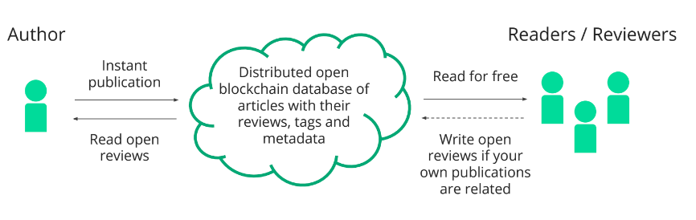

+++
author = "Matt Lilley"
title = "Rvu"
date = "2017-09-25"
tags = [
    "technology"
]
subtitle="A decentralised peer-reviewed publication platform"
description="It's no secret that academic publishing is dysfunctional. Much has been written about the problems and potential solutions. A friend and I have begun gathering our own thoughts on how to \"fix\" academic publishing."
+++

It's no secret that academic publishing is dysfunctional. Much has been written about the [problems](https://www.theguardian.com/science/2017/jun/27/profitable-business-scientific-publishing-bad-for-science) and potential [solutions](https://f1000research.com/articles/6-1151/v3).

A friend and I have begun gathering our own thoughts on how to "fix" academic publishing. We want to create 

> Rvu (Review) - a decentralised peer-reviewed publication platform

We made this [little slide deck](https://drive.google.com/file/d/0B61TfSXkBtmtTlU4bm9Ib2swams/view?usp=sharing&resourcekey=0-r9qdAQfoi-OXTUeTS09HXQ) outlining our fledgling ideas and enabling technologies like blockchain, IPFS and machine learning. 

<iframe src="https://drive.google.com/file/d/0B61TfSXkBtmtTlU4bm9Ib2swams/preview" width="100%" height="480" allow="autoplay"></iframe>

These are of course [not new ideas](https://www.reddit.com/r/CryptoCurrency/comments/2mlql3/crazy_idea_use_the_blockchain_technology_for_peer/) (is there ever such a thing 🤔 ) but we are inspired that we were not alone.

If you like this idea and would like to collaborate with us on it, please [get in touch](/about/#contact).