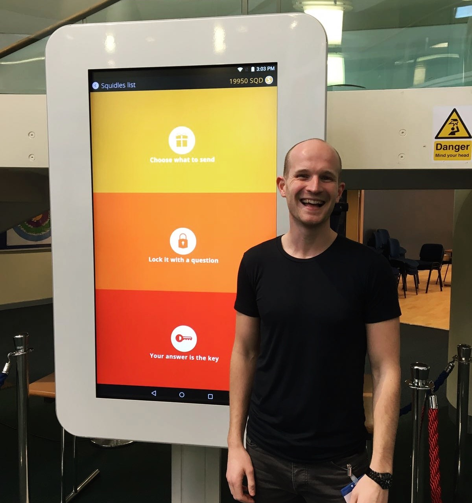

+++
author = "Matt Lilley"
title = "Squidler"
date = "2021-02-17"
tags = [
    "technology"
]
description="Squidler is an app that a couple of friends and I dreamt up in October 2013. We wanted to turn messaging into a game. We didn't know how to code, so we taught ourselves by learning as we were building 👨‍💻. It was our first coding project so we made a lot of the classic mistakes but we learnt a lot about coding and we learnt some valuable life lessons."
subtitle="Reflections on my first attempt at making a tech business"
toc = true
+++

## The story

[Squidler](https://web.archive.org/web/20201229152017if_/http://squidler.com/) is an app that a couple of friends and I dreamt up in October 2013. We wanted to turn messaging into a game. We didn't know how to code, so we taught ourselves by learning as we were building 👨‍💻 . It was our first coding project so we made a lot of the classic mistakes, e.g. not verifying that anyone actually wanted what we were building 🤦‍♂️ .

It took blood, sweat and tears 😫 , but we eventually finished the project (in 2016 😱 ). We got involved in some fun bits of publicity:



but still almost no one downloaded Squidler 😔. Undeterred, we made big plans for Squidler as you can see from the [pitch deck](https://drive.google.com/file/d/0B61TfSXkBtmtVnpISmF5eF9keFE/view?resourcekey=0-VfwJQnTEUobQAoUnrngsXw) we made at the start of 2017:

You might need to enable cookies to see the PDF below
<iframe src="https://drive.google.com/file/d/0B61TfSXkBtmtVnpISmF5eF9keFE/preview" width="100%" height="480" allow="autoplay"></iframe>

Although our plans never materialised (burn-out is a real thing), I'm still proud of what we did. We learnt a lot about coding and we learnt some valuable life lessons:

- 💡 Ideas are cheap, execution is the hard part
- 🙊 Don't hold onto your ideas for too long
- 😈 Premature optimisation is the devil

## The code

Every now and again (when I'm cleaning up my hard drive), I look back at the code and am struck by how much we built with no previous experience - thank god for Stackoverflow 🤣 ! I wanted there to be a record what what we did, so that we'll have something to look back at #nostalgia.

You can find all the code on the [Squidler repo on Github](https://github.com/mklilley/squidler/). Below is a summary of what we built.

### Front end

We were quite taken with how accessible coding on the web was, so we decided to build Squidler as a "hybrid" app, i.e. code the app in html, css and js and add an iOS/Android native wrapper that would allow it to be installed from the App Store or Google Play.

It was still the early days of web apps, frameworks like React had only just been released to the world and jQuery was king. We fell in love with the two way data binding of AngularJS and so opted for the Ionic framework which allowed us to build AngularJS hybrid apps "easily".

### Back end

It was also early days for the new kid on the block - nodejs. We started Squilder on PHP and used MySQL as our database. In the end, we migrated to nodejs and used the ActionHeroJS framework to make our lives a LOT easier. For the database we used a combination of mongodb for media files and Redis for text data because... we apparently wanted to make things more difficult for ourselves 🤣.

