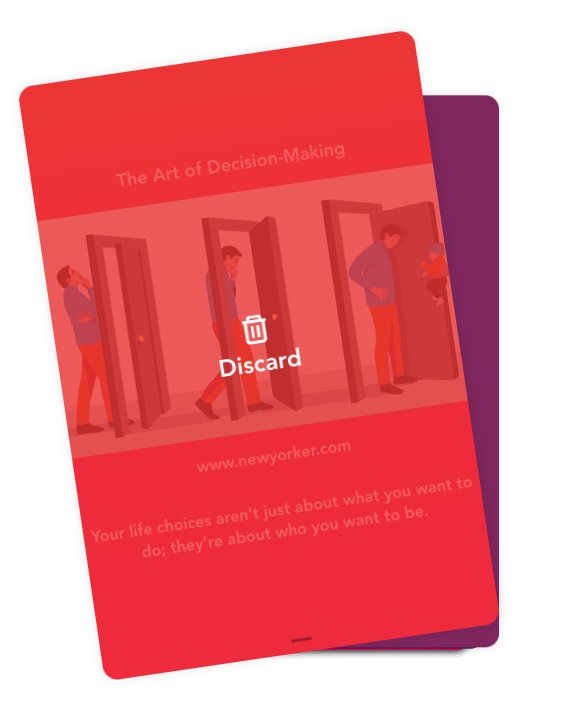
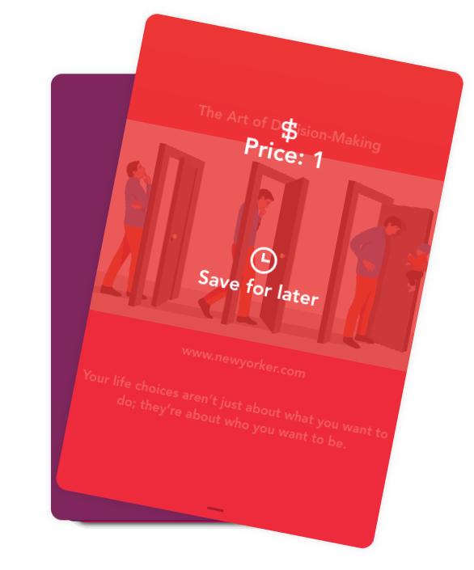

+++
author = "Matt Lilley"
title = "Swipee"
date = "2021-03-28"
description = "Reading lists suck! Save everything for later and then get paralysed by choice 😣 Swipee makes the choice for you. Instead of a reading list, Swipee uses a deck of swipeable cards. This way, you'll never have to see your ever growing list of content 🙌"
subtitle="The no-list reading list app"
tags = [
    "technology"
]
+++

**Reading lists suck!** If you're anything like me, then you're interested in everything but see opportunity cost around every corner. Save everything for later and then get paralysed by choice. Hunker down for a long read, watch a quick video or catch up with one of the dozens of podcasts you subscribe to ? 😣

This is why I made [Swipee](https://swipee.lilley.io/). Instead of a reading list, Swipee uses a deck of swipeable cards:

This way, you'll never have to see your ever growing list of content 🙌 . Swipee also helps you to be more honest about the content you want to save for later. By using financial incentives, Swipee encourages you to think twice before you swipe right.

## The history of Swipee

I built a basic version of Swipee in the Spring of 2018 and have been using it every day since. I thought other people might also find it useful, so I decided to clean it up and make it available to everyone for free.

If you like [Swipee](https://swipee.lilley.io/) then please consider giving it an up-vote on [Product Hunt](https://www.producthunt.com/products/swipee
).

## How I made Swipee

If you're interested in geeking out over how I built Swipee then you can find out more at the [Swipee Github repo](https://github.com/mklilley/swipee).