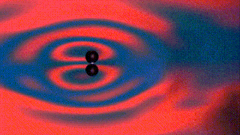

+++
author = "Matt Lilley"
title = "Walking droplets"
date = "2018-07-31"
description = "What's really interesting about these fluid dynamics experiments is that they appear to produce similar behaviour as seen in quantum mechanics 🤯. This result isn't new either - it was first observed in 2006."
subtitle="Quantum behaviour from a classical system"
tags = [
    "science"
]
toc=true
+++

## Pilot waves

Although I've got a PhD in physics, and took too many quantum physics classes to count, I never really liked quantum physics. I'm of course not alone in this. Quantum physicist is notorious for being unintuitive and there have been several attempts to do away with the quantum idea that the universe in inherently random, e.g. [hidden variable theories](https://en.wikipedia.org/wiki/Hidden-variable_theory).

I was always quite taken by a hidden variable theory proposed by Bohm - the pilot wave theory[^1]. The theory posits the idea that particles have a definite position, but their dynamics are determined by a "pilot wave" that guides the particles around. This theory is deterministic and explains wave-particle duality in a straightforward way. I never had the time to look much into the merits and pitfalls of this idea, but it was thrust into my awareness again recently when I came across some experiments with "walking droplets" on YouTube ["Shedding Light on Pilot Wave Phenomena"](https://youtu.be/Hopd-gKB1Xc).

Very roughly, these experiments involved:
- Taking a loudspeaker and attaching to it a petri dish
- Filling the dish with silicone oil
- Playing a single tone through the loudspeaker
- Flicking the surface of the oil with a pin to create droplets
- Watching as the droplets move around and interact with each other

What's really interesting about these fluid dynamics experiments is that they appear to produce similar behaviour as seen in quantum mechanics 🤯. This result isn't new either - it was first observed in 2006 [^2]. 

It's not clear to me how quantum behaviour can come out of this fluid system, but what makes the fluid system complex is the interplay between the standing waves produced by the loudspeaker (which guide the droplets) and the waves produced by the bouncing droplets as they are guided around. It's such a cool system!

## Matt's "walkers"

I wanted to have a go at making some walking droplets (aka walkers) myself so I followed the [experimental setup from the MIT group](https://link.springer.com/article/10) (sorry it's behind a paywall 😞) and voila.

### Stable configurations



It is fascinating that you can sometimes create a stable configuration where orbiting droplets sit right next to pairs of oscillating ones.

### Disturbing a cluster



By adjusting the volume on the loudspeaker you can break up existing clusters of droplets.

---

### 3 body interaction  - preservation of 2 body orbit



Sometimes, a third droplet interacts weakly with 2 droplets circulating around each other.

---

### 3 body interaction  - destruction of 2 body orbit



Sometimes, a third droplet will destroy an orbiting pair.

[^1]: See [Bohmian Mechanics](https://plato.stanford.edu/entries/qm-bohm/) on 
Stanford Encyclopedia of Philosophy and [bohmian-mechanics.net](https://bohmian-mechanics.net/) for good resources on the topic
[^2]: [Single-Particle Diffraction and Interference at a Macroscopic Scale Physical Review Letters, (2006)](https://journals.aps.org/prl/abstract/10.1103/PhysRevLett.97.154101)