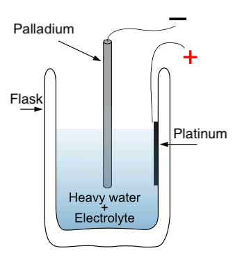

+++
author = "Matt Lilley"
title = "What is cold fusion?"
date = "2020-03-14"
tags = [
    "science"
]
subtitle="Past, present, future"
description="Imagine a future where households and businesses generate their own clean energy. No more reliance on massive power plants, no more coal, oil, or even solar and wind farms. This decentralised energy future is the promise of cold fusion, a controversial field of study within the realm of physics which would revolutionise the world if it could be harnessed. "
series = ["Cold fusion LENR"]
toc = true
+++



## Decentralised energy future
Imagine a future where households and businesses generate their own clean energy. No more reliance on massive power plants, no more coal, oil, or even solar and wind farms. This decentralised energy future is the promise of cold fusion, a controversial field of study within the realm of physics which would revolutionise the world if it could be harnessed. 

The story of cold fusion begins in 1989 with two electrochemists, Martin Fleischmann and Stanley Pons (F&P). They claimed to have observed nuclear fusion on a table-top chemistry experiment at room temperature. The announcement took the world by storm and sparked a 30+ year quest for what some people call the holy grail of energy.

But, what even is fusion? How does it differ from cold fusion? Why is there such controversy surrounding this topic? Are the skeptics totally justified? What does a typical cold fusion experiment look like and why are we still waiting for a reproducible experiment 30 years on. A lot to cover, let's dig in.

## What is fusion?
It's the process that lights up our skies - the powerhouse of the stars. In stars like our sun, the hydrogen core is 15 million degrees Celsius. When conditions are that hot, the hydrogen nuclei smash together at incredible speeds, merging into a new helium nucleus and giving off enormous amounts of energy in the process.

## Why fusion?
### Clean
The byproduct of fusing hydrogen is helium - everybody's favorite party gas 🎈. The fusion process doesn't produce greenhouse gases or radioactive waste. This means fusion has the potential to solve our energy needs without contributing to climate change or leaving behind harmful waste.

### Abundant 
The specific form of hydrogen used in fusion, deuterium, is plentiful in all water on Earth, including seawater, freshwater, and even drinking water - we're talking about enough for billions of years. This means that with fusion, we can tap into an almost inexhaustible supply of energy.

### Compact
Fusion has an energy density a million times more than that of fossil fuels. In practical terms, a small amount of fusion fuel can produce the same amount of energy as a much larger quantity of fossil fuels. For example, a typical glass of heavy water contains a lifetimes worth of fuel. That's a testament to the compactness of fusion energy.

## Anatomy of a cold fusion experiment

The essence of the F&P experiment, for instance, involved the absorption (aka loading) of deuterium into a palladium electrode in a heavy water solution - a process known as electrolysis. 

Once the palladium electrode had absorbed a certain amount of deuterium, it would produce excess heat, which F&P believed to be a result of nuclear fusion. 

It's worth noting that the F&P experiment isn't the only path being explored for cold fusion. Cold fusion materials and their preparation are varied. For instance, palladium isn't the only hydrogen loving material - there's also nickel, niobium, zirconium, titanium and samarium. These materials can also be made into: rods, wires, meshes, powers, plates, foams, thin films and can be loaded via electrolysis, high pressured gas and plasma discharge.

## Cold fusion skepticism
### Scale
The size of traditional fusion experiments has been a significant factor contributing to skepticism. The only fusion experiments conducted on Earth as of 1989 were carried out in massive machines like JET (Joint European Torus), located just south of Oxford in the UK. 

 in grey for scale. EFDA JET CC BY-SA 3.0")

In 1989 JET was (and still is today) the world's largest operating hot fusion machine. It operates at incredibly high temperatures, reaching up to 150 million degrees Celsius, which is ten times hotter than the center of the Sun. This stark contrast in scale and conditions between traditional fusion experiments and the claims made by F&P was a primary reason for skepticism.

### Radiation
Another significant concern surrounding fusion is radiation. Traditional fusion experiments emit hazerdous neutron radiation. Fusion devices are typically encased in thick concrete shells several meters thick to contain the radiation. However, F&P conducted their experiment in a lab without such elaborate safety measures, and they were unharmed. This raised eyebrows and led to skepticism because it contradicted the expectations based on traditional fusion experiments.

## Scientific protocol

F&P’s claims were met with intense scrutiny and skepticism. Critics argued that their findings contradicted established theories of nuclear physics. Efforts to replicate their experiments yielded inconsistent results, leading to widespread doubt about the validity of their claims. Specifically, replications were made over many months in reputable labs, e.g. [Los Alamos](https://www.deseretnews.com/article/78011/LOS-ALAMOS-VERIFIES-TRITIUM-PRODUCTION-IN-COLD-FUSION-TESTS.html) and [SRI international](https://pdfs.semanticscholar.org/b2ab/364ef13574f30b41ef87cf8fa69e2c25dcff.pdf), but failed replication attempts done over several days at [MIT](https://link.springer.com/article/10.1007/BF02627578) and [Caltech](https://www.nature.com/articles/340525a0) had greater influence on the scientific community. F&P were [ridiculed in public](https://youtu.be/pK94vmpB6Y0?t=1304) and accused of being [incompetent, delusional](https://web.archive.org/web/20220902044906/https://archive.nytimes.com/www.nytimes.com/library/national/science/050399sci-cold-fusion.html) and [fraudulent](https://web.archive.org/web/20111014223621/https://newenergytimes.com/v2/sr/ColdFusion1989/MIT/OnTheAllegationsOfFraud.shtml).

Although F&P made were rightly criticised for their poor communication around their experiments, I believe that influential scientists who strongly opposing F&P were also at fault for forgetting:
- **Science does not require theory in advance**. The scientific method puts observations above all else. For example, the theory of superconductivity was not formulated until 46 years after its initial discovery. 
- **Science does not demand consistent reproducibility**. Indeed, as Nobel prize winner Norman Ramsey wrote on cold fusion, "even a single short but valid cold fusion period would be revolutionary". Furthermore, ground breaking experiments are often difficult to reproduce because we do not yet have control over all the experimental variables, e.g. the first cloned mammal (Dolly the sheep) took 227 attempts.
- **Science does not demand speed** - indeed confirmation that Dolly the sheep was a genuine clone took 18 months. 

## Current status of cold fusion
The field of cold fusion is still fraught with difficulties even after decades of research. The precise nature of cold fusion remains elusive due to a lack of consistency in experimental results. This inconsistency can be attributed to minute variations in experimental conditions and materials. For instance, small differences in the nano-scaled structure of the palladium can affect the outcomes significantly. The human factor is equally important. The drive for prestige and potential financial rewards can cloud judgment, leading to overstated claims or overly optimistic interpretations of results. Money can help with materials, but no amount of money can remove the ego I'm afraid.

## Open science
The future of cold fusion could greatly benefit from a philosophy of open science— a commitment to transparency, sharing, and collaboration in the pursuit of knowledge. The World Wide Web and Arduino are shining examples of this approach. Sir Tim Berners-Lee chose not to patent the World Wide Web, allowing it to revolutionize information sharing. Arduino, a company manufacturing small computers, open-sourced their designs, enabling innovation and improvements. Embracing this philosophy in cold fusion research could help us overcome existing hurdles, elucidate the underlying mechanisms and hopefully speed up the progress towards a clean, decentralised energy future.